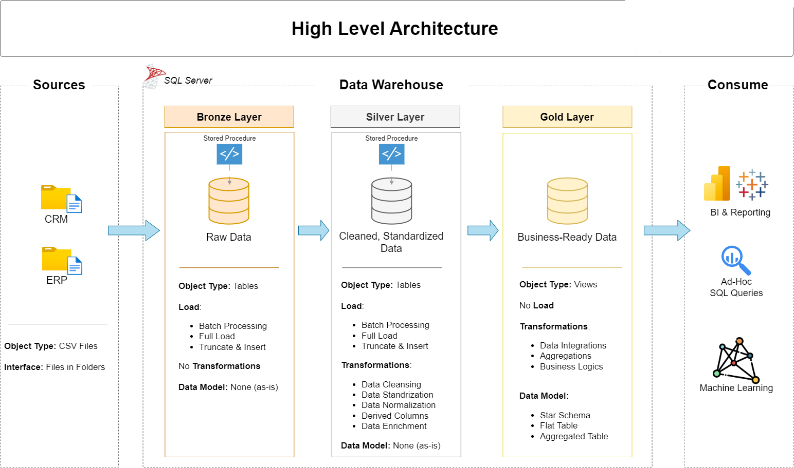

# sql-data-warehouse-project
Building a Data Warehouse with SQL Server, including ETL processes, data modelling and analytics.

Welcome to the **Data Warehouse and Analytics Project** repository! 
This project demonstrates a comprehensive data warehousing and analytics solution, from building a data warehouse to generating actionable insights. Designed as a portfolio project, it highlights industry best practices in data engineering and analytics.

---
## 🏗️ Data Architecture

The data architecture for this project follows ***Medallion Architecture*** **Bronze**, **Silver**, and **Gold** layers:


1. **Bronze Layer**: Stores raw data as-is from the source systems. Data is ingested from CSV Files into SQL Server Database.
2. **Silver Layer**: This layer includes data cleansing, standardization, and normalization processes to prepare data for analysis.
3. **Gold Layer**: Houses business-ready data modeled into a star schema required for reporting and analytics.

---
## 📖 Project Overview

This project involves:

1. **Data Architecture**: Designing a Modern Data Warehouse Using Medallion Architecture **Bronze**, **Silver**, and **Gold** layers.
2. **ETL Pipelines**: Extracting, transforming, and loading data from source systems into the warehouse.
3. **Data Modeling**: Developing fact and dimension tables optimized for analytical queries.
4. **Analytics & Reporting**: Creating SQL-based reports and dashboards for actionable insights.

🎯 For:
- SQL Development
- Data Architect
- Data Engineering  
- ETL Pipeline Developer
- Data Modeling  
- Data Analytics  

---

## 🛠️ Important Links & Tools:

Everything is for Free!
- **[Datasets](datasets/):** Access to the project dataset (csv files).
- **[SQL Server Express](https://www.microsoft.com/en-us/sql-server/sql-server-downloads):** Lightweight server for hosting your SQL database.
- **[SQL Server Management Studio (SSMS)](https://learn.microsoft.com/en-us/sql/ssms/download-sql-server-management-studio-ssms?view=sql-server-ver16):** GUI for managing and interacting with databases.
- **[Git Repository](https://github.com/):** Set up a GitHub account and repository to manage, version, and collaborate on your code efficiently.

---

## 🚀 Project Requirements

### Building the Data Warehouse (Data Engineering)

#### Objective
Develop a modern data warehouse using SQL Server to consolidate sales data, enabling analytical reporting and informed decision-making.

#### Specifications
- **Data Sources**: Import data from two source systems (ERP and CRM) provided as CSV files.
- **Data Quality**: Cleanse and resolve data quality issues prior to analysis.
- **Integration**: Combine both sources into a single, user-friendly data model designed for analytical queries.
- **Scope**: Focus on the latest dataset only; historization of data is not required.
- **Documentation**: Provide clear documentation of the data model to support both business stakeholders and analytics teams.

---

### BI: Analytics & Reporting (Data Analysis)

#### Objective
Develop SQL-based analytics to deliver detailed insights into:
- **Customer Behavior**
- **Product Performance**
- **Sales Trends**

These insights empower stakeholders with key business metrics, enabling strategic decision-making.  

For more details, refer to [docs/requirements.md](docs/requirements.md).

## 📂 Repository Structure
```
sql-data-warehouse-project/
│
├── data-analysis/                          # Advanced business and analytical SQL queries
│   ├── 01_ChangeOverTime(Trends).sql       # Analyze trends and changes over time
│   ├── 02_CumulativeAnalysis.sql           # Running totals and cumulative metrics
│   ├── 03_PerformanceAnalysis.sql          # Product and business performance analysis
│   ├── 04_PartToWholeAnalysis.sql          # Percentage contribution analysis
│   ├── 05_DataSegmentation.sql             # Customer and data segmentation
│   ├── 06_ReportCustomers.sql              # Customer-level analytical report
│   └── 07_ReportProducts.sql               # Product-level analytical report
│
├── datasets/                               # Raw ERP and CRM CSV datasets
│
├── docs/                                   # Project architecture and documentation
│   └── data_architecture.png               # Medallion architecture diagram
│
├── exploratory-data-analysis/              # SQL scripts for exploring warehouse data
│   ├── 01_ExploringDataSet.sql             # Database and dataset exploration
│   ├── 02_MeasureExploration.sql           # Explore key business measures
│   ├── 03_MagnitudeAnalysis.sql             # Analyze magnitude across dimensions
│   └── 04_RankingAnalysis.sql               # Rank products and business entities
│
├── scripts/                                # Data warehouse and ETL SQL scripts
│   │
│   ├── bronze/                             # Raw data ingestion layer
│   │   ├── bronze_ddl.sql                  # Create Bronze layer tables
│   │   └── bronze_inserting_data.sql       # Load ERP and CRM source data
│   │
│   ├── silver/                             # Data cleansing and transformation layer
│   │   ├── silver_ddl.sql                  # Create Silver layer tables
│   │   └── silver_inserting_data.sql       # Clean, standardize, and load data
│   │
│   ├── gold/                               # Business-ready analytical layer
│   │   └── gold_ddl.sql                    # Create fact and dimension models
│   │
│   └── initialize_database.sql             # Initialize DataWarehouse database
│
├── test/                                   # Data quality and validation scripts
│   ├── gold_QoS.sql                        # Validate Gold layer data quality
│   └── silver_QoS.sql                      # Validate Silver layer data quality
│
├── LICENSE                                 # MIT License
└── README.md                               # Project overview and documentation
```
---


